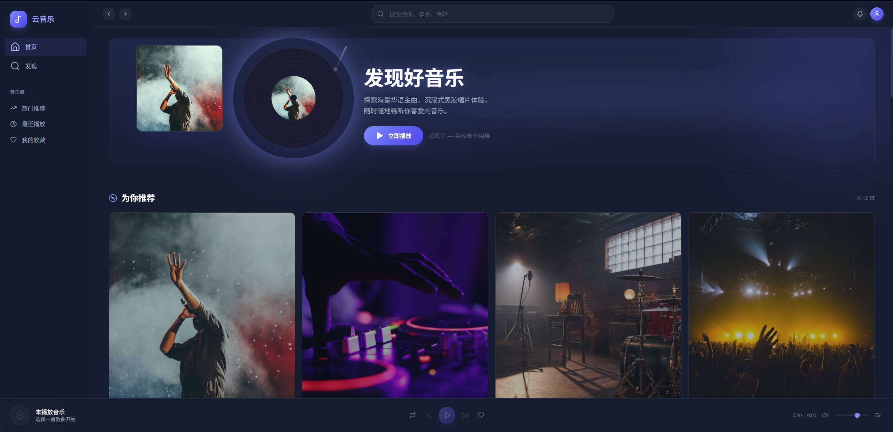
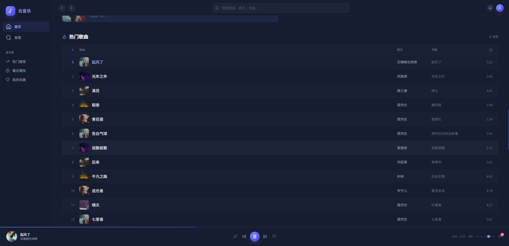
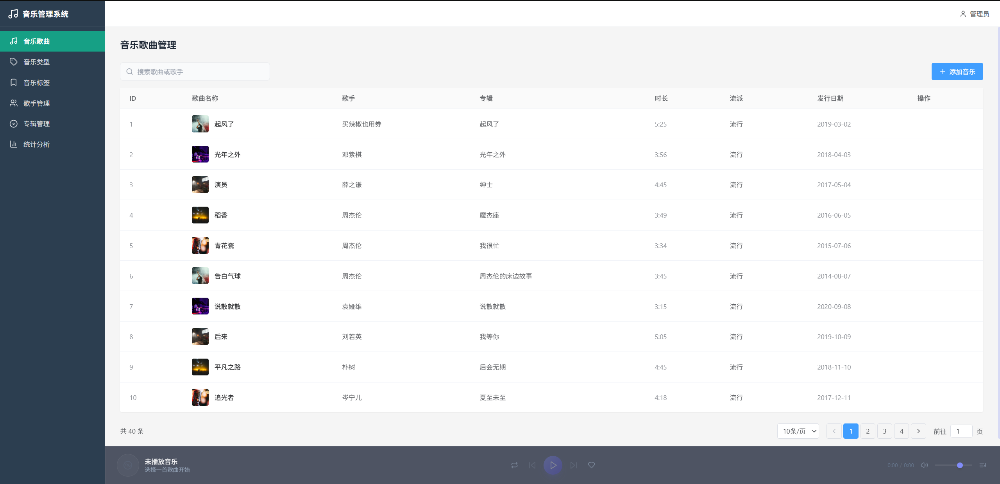

<!-- PROJECT LOGO -->
<br />
<div align="center">
  <a href="#">
    
  </a>

  <h1 align="center">🎵 云音乐</h1>

  <p align="center">
    全栈在线音乐播放平台 — 前端播放 + 后台管理
    <br />
    基于 Vue 3 + TypeScript + Express + MySQL 构建
    <br />
    <br />
    <a href="#-功能特性"><strong>功能特性</strong></a>
    ·
    <a href="#-快速开始"><strong>快速开始</strong></a>
    ·
    <a href="#-页面展示"><strong>页面展示</strong></a>
    ·
    <a href="#-技术栈"><strong>技术栈</strong></a>
  </p>

  <p align="center">
    
    
    
    
    
    
    
    
  </p>
</div>

<br />

---

## 📖 项目简介

**云音乐** 是一款仿网易云音乐的**全栈在线音乐播放平台**，包含两大核心系统：

### 🎧 前端用户平台（深色主题）
- 音乐发现首页 — 个性化推荐、热门歌曲展示
- 音乐播放器 — 全功能播放控制、进度拖拽、音量调节
- 评论互动 — 热门评论 / 最新评论双 Tab 切换、发布评论、点赞
- 歌曲列表 — 分类浏览、搜索筛选
- 底部迷你播放栏 — 跨页面常驻播放

### ⚙️ 后台管理系统（浅色主题）
- **歌曲管理** — CRUD 操作、批量管理、分页浏览
- **歌手管理** — 歌手信息维护
- **专辑管理** — 专辑数据管理
- **类型管理** — 音乐分类标签
- **标签管理** — 多维度标签体系
- **统计分析** — 数据可视化面板
- 用户认证与权限控制

---

## ✨ 功能特性

| 模块 | 功能描述 |
|------|----------|
| 🔐 **用户认证** | 登录注册、JWT Token 鉴权、角色权限分离（管理员/普通用户） |
| 🏠 **音乐首页** | 轮播推荐、个性化歌单、为你推荐卡片墙 |
| 🎵 **歌曲管理** | 表格展示、搜索过滤、分页、添加/编辑/删除歌曲 |
| 🎤 **歌手/专辑** | 歌手详情页、专辑列表、关联关系管理 |
| 🏷️ **分类标签** | 音乐类型多级分类、标签体系 |
| 🎧 **播放器** | 播放/暂停、上/下曲切换、进度拖拽、音量控制、静音切换 |
| 🔀 **播放模式** | 顺序播放、随机播放、单曲循环三种模式 |
| ❤️ **收藏功能** | 一键收藏 / 取消收藏歌曲 |
| 💬 **评论区** | 热门/最新评论双 Tab、发布评论、点赞互动 |
| 📊 **数据统计** | 歌曲数量、用户活跃度等多维统计图表 |
| 📱 **响应式布局** | 适配桌面端与移动端 |

### 交互亮点

- 🔄 专辑封面播放时旋转动画（3 秒一圈）
- 🎚️ 进度条支持点击跳转 + 拖拽手柄
- 💎 毛玻璃效果导航栏（Glassmorphism）
- ✅ 完整的表单验证（必填校验 + 错误提示）
- 🔗 URL 驱动的路由状态（搜索参数同步至地址栏）
- ⚡ 前后端分离架构，Express API + Vite 代理开发

---

## 🛠 技术栈

### 前端技术

| 技术 | 说明 |
|------|------|
| **Vue 3** | 渐进式前端框架，Composition API |
| **TypeScript** | 类型安全的 JavaScript 超集 |
| **Vue Router 4** | 单页应用路由管理 |
| **Pinia** | 新一代 Vue 状态管理库 |
| **Tailwind CSS** | 原子化 CSS 框架，自定义深色主题 |
| **Vite** | 下一代前端构建工具 |
| **Lucide Icons** | 精美 SVG 图标库 |

### 后端技术

| 技术 | 说明 |
|------|------|
| **Node.js** | JavaScript 运行时 |
| **Express** | 高性能 Web 服务框架 |
| **MySQL** | 关系型数据库存储 |
| **JWT (jsonwebtoken)** | 用户身份认证 |
| **bcryptjs** | 密码加密存储 |
| **Multer** | 文件上传处理（封面图等） |
| **CORS** | 跨域资源访问支持 |

---

## 📁 项目结构

```
Music-app/
├── index.html                          # 入口 HTML
├── package.json                        # 项目元数据与脚本
├── vite.config.ts                      # Vite 配置（API 代理）
├── tailwind.config.js                  # Tailwind 自定义主题
├── tsconfig.json                       # TypeScript 配置
├── server/                             # ★ 后端服务
│   ├── index.js                        #   Express 入口 & 中间件配置
│   ├── db/                             #   数据库
│   │   ├── init.js                     #   数据库初始化脚本
│   │   └── init.sql                    #   建表 SQL
│   ├── middleware/                     #   中间件
│   │   └── auth.js                     #   JWT 认证中间件
│   ├── routes/                         #   API 路由
│   │   ├── auth.js                     #   注册/登录
│   │   ├── songs.js                    #   歌曲 CRUD
│   │   ├── artists.js                  #   歌手管理
│   │   ├── albums.js                   #   专辑管理
│   │   ├── genres.js                   #   音乐类型
│   │   ├── tags.js                     #   标签管理
│   │   └── stats.js                    #   统计数据
│   ├── seed/                           #   数据种子
│   └── utils/                          #   工具函数
├── public/                             # 静态资源
│   └── music.svg                       # Favicon 图标
├── screenshots/                        # 项目截图
└── src/                                # ★ 前端源码
    ├── main.ts                         # 应用入口
    ├── App.vue                         # 根组件
    ├── index.css                       # 全局样式（Tailwind + 自定义主题）
    ├── router/
    │   └── index.ts                    # 路由配置
    ├── stores/                         # Pinia 状态管理
    │   ├── types.ts                    # TypeScript 接口定义
    │   ├── auth.ts                     # 认证状态
    │   ├── player.ts                   # 播放器状态
    │   └── data.ts                     # 数据层（API 请求封装）
    ├── views/
    │   ├── Login.vue                   # 登录页
    │   ├── FrontHome.vue               # 前端首页（用户端）
    │   ├── Home.vue                    # 管理后台主页
    │   ├── Search.vue                  # 搜索页
    │   ├── Player.vue                  # 播放器页
    │   └── admin/                      # 管理后台子页面
    │       ├── Artists.vue             # 歌手管理
    │       ├── Albums.vue              # 专辑管理
    │       ├── Genres.vue              # 类型管理
    │       ├── Tags.vue                # 标签管理
    │       └── Statistics.vue          # 统计分析
    └── components/
        ├── layout/                     # 布局组件
        │   ├── AppHeader.vue           # 顶部导航
        │   ├── AppFooter.vue           # 底部播放栏
        │   └── Sidebar.vue             # 侧边栏
        ├── ui/                         # 通用 UI 组件
        │   ├── Dialog.vue              # 对话框
        │   ├── Pagination.vue          # 分页器
        │   └── SongForm.vue            # 歌曲表单
        └── comments/
            └── CommentSection.vue      # 评论区
```

---

## 🚀 快速开始

### 环境要求

- **Node.js** >= 18.0.0
- **MySQL** >= 8.0
- **npm** >= 9.0.0

### 1. 克隆仓库

```bash
git clone https://github.com/Seredipited/Music-app.git
cd Music-app
```

### 2. 安装依赖

```bash
npm install
```

### 3. 配置数据库

在 MySQL 中创建数据库并执行初始化脚本：

```sql
CREATE DATABASE music_app DEFAULT CHARACTER SET utf8mb4 COLLATE utf8mb4_general_ci;
```

编辑 `server/db/init.sql` 或运行初始化脚本：

```bash
npm run db:init
```

### 4. 启动后端服务

```bash
# 启动 Express 服务器（默认 http://localhost:8080）
npm run server

# 或使用热重载模式
npm run server:dev
```

### 5. 启动前端开发服务器

```bash
# 启动 Vite 开发服务器（默认 http://localhost:5173）
npm run dev
```

> Vite 已配置代理，前端 `/api` 请求会自动转发到后端 `http://localhost:8080`

### 构建部署

```bash
# 生产构建
npm run build

# 预览生产构建
npm run preview

# 生产环境启动（同时启动前后端）
npm start
```

---

## 🖼 页面展示

### 🎧 前端用户平台

<table>
  <tr>
    <td width="50%" align="center">
      
      <br />
      <sub><b>🏠 发现首页</b> — 轮播推荐、个性化歌单、为你推荐</sub>
    </td>
    <td width="50%" align="center">
      
      <br />
      <sub><b>🎵 音乐播放器</b> — 播放控制、进度条、音量调节、评论互动</sub>
    </td>
  </tr>
  <tr>
    <td width="50%" align="center">
      
      <br />
      <sub><b>📋 热门歌曲</b> — 歌曲列表浏览、搜索过滤、分页展示</sub>
    </td>
    <td></td>
  </tr>
</table>

### ⚙️ 后台管理系统

<table>
  <tr>
    <td align="center">
      
      <br />
      <sub><b>🎼 音乐歌曲管理</b> — 歌曲增删改查、搜索过滤、分页操作</sub>
    </td>
  </tr>
</table>

---

## 🧠 核心设计

### 前端状态管理（Pinia）

```typescript
// 核心 Store 结构
interface AuthState {
  token: string | null        // JWT Token
  userInfo: User | null       // 当前用户信息
  isLoggedIn: boolean         // 登录状态
}

interface PlayerState {
  currentSong: Song | null     // 当前播放歌曲
  playlist: Song[]             // 播放列表
  isPlaying: boolean           // 播放状态
  currentTime: number          // 当前时间
  volume: number               // 音量 0-1
  playMode: PlayMode           // 播放模式
  likedSongs: Set<number>      // 收藏集合
}
```

### API 接口设计

| 模块 | 方法 | 路径 | 说明 |
|------|------|------|------|
| 认证 | POST | `/api/auth/register` | 用户注册 |
| 认证 | POST | `/api/auth/login` | 用户登录 |
| 歌曲 | GET | `/api/songs` | 获取歌曲列表 |
| 歌曲 | POST | `/api/songs` | 添加歌曲 |
| 歌曲 | PUT | `/api/songs/:id` | 编辑歌曲 |
| 歌曲 | DELETE | `/api/songs/:id` | 删除歌曲 |
| 歌手 | CRUD | `/api/artists` | 歌手管理 |
| 专辑 | CRUD | `/api/albums` | 专辑管理 |
| 类型 | CRUD | `/api/genres` | 类型管理 |
| 标签 | CRUD | `/api/tags` | 标签管理 |
| 统计 | GET | `/api/stats` | 统计数据 |

---

## 🎨 主题定制

项目采用 Tailwind CSS 自定义四套色彩系统，支持深色/浅色双主题：

| 色系 | 主色 | 使用场景 |
|------|------|----------|
| **primary** | `#6366f1`（靛蓝） | 全局主色调、按钮、链接 |
| **warm** | `#f97316`（橙色） | 强调元素、hover 状态 |
| **earth** | `#b8956f`（大地色） | 播放器区域装饰 |
| **dark** | 深蓝灰系 | 前端深色主题背景 |

### 自定义动画

- `spin-slow` — 3 秒慢速旋转（专辑封面动画）
- `pulse-glow` — 脉冲发光效果
- `slide-up` / `fade-in` — 入场过渡动画

---

## 📝 可用脚本

| 命令 | 说明 |
|------|------|
| `npm run dev` | 启动 Vite 前端开发服务器 |
| `npm run build` | TypeScript 类型检查 + 生产构建 |
| `npm run preview` | 预览生产构建版本 |
| `npm run server` | 启动 Express 后端服务器 |
| `npm run server:dev` | 热重载模式启动后端 |
| `npm run db:init` | 执行数据库初始化 |
| `npm start` | 生产模式启动后端服务 |

---

## 🤝 贡献指南

欢迎贡献代码！请遵循以下流程：

1. **Fork** 本仓库
2. 创建特性分支：`git checkout -b feature/amazing-feature`
3. 提交更改：`git commit -m 'feat: add amazing feature'`
4. 推送到分支：`git push origin feature/amazing-feature`
5. 创建 **Pull Request**

### 提交规范

本项目推荐使用 [Conventional Commits](https://www.conventionalcommits.org/) 规范：

- `feat:` — 新功能
- `fix:` — Bug 修复
- `refactor:` — 代码重构
- `style:` — 样式调整
- `docs:` — 文档更新
- `chore:` — 构建/工具链变更

---

## 📄 开源协议

本项目基于 **MIT License** 开源。

<div align="center">
  <br />
  <p>如果这个项目对你有帮助，请给一个 ⭐ Star 支持一下！</p>
  <br />
  <sub>Made with ❤️ by Seredipited</sub>
</div>
